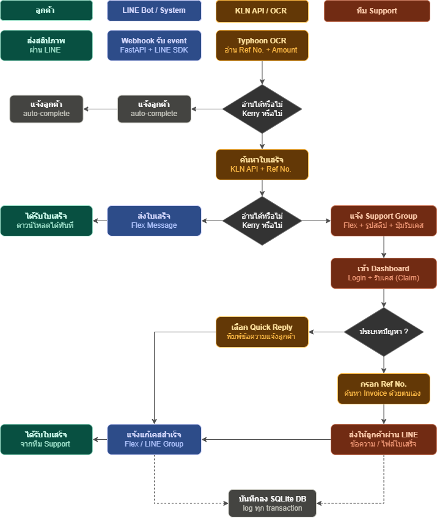
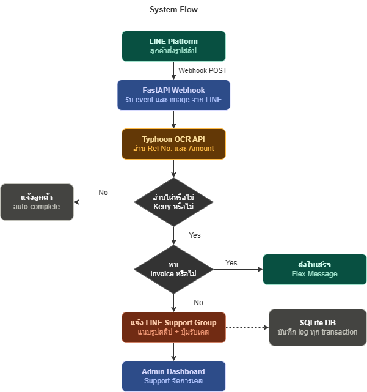
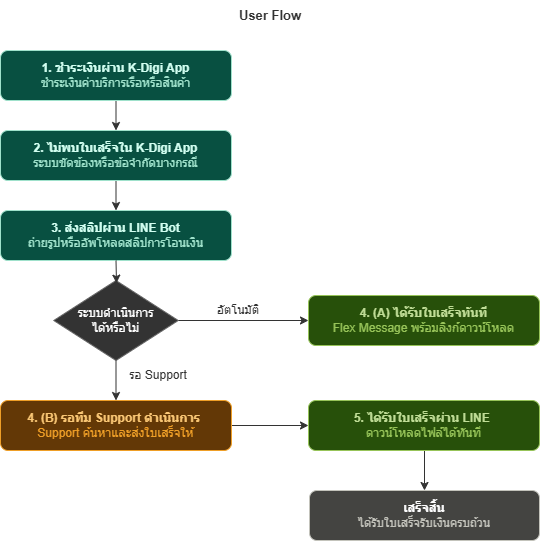
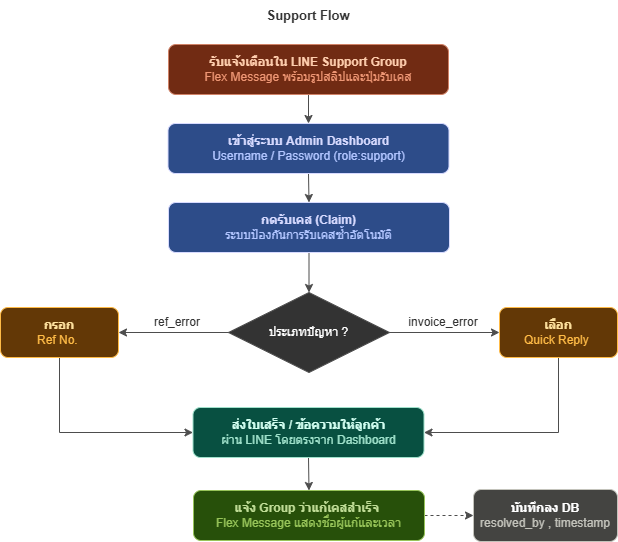
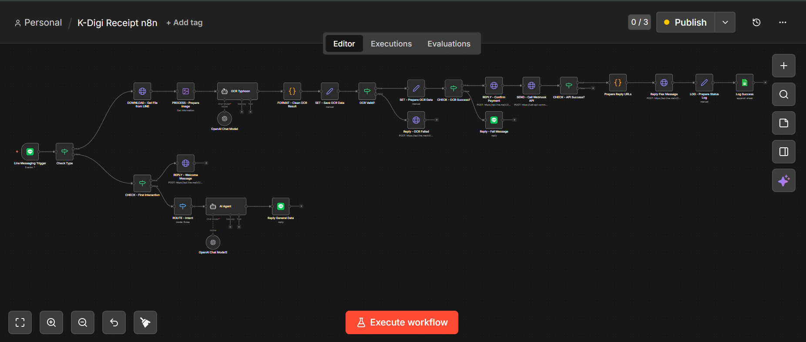

# K-Digi Receipt Bot
### Automated Slip Verification and Receipt Delivery System Using LINE Messaging API

> โครงงานสหกิจศึกษา / ผลงานระหว่างการฝึกงาน  
> บริษัท KLN Seaport Ltd. | ปีการศึกษา 2567

---

## ข้อมูลผู้จัดทำ

| รายการ | รายละเอียด |
|---|---|
| ชื่อ-นามสกุล | นางสาววิลาสินี ขำน้ำคู้ |
| รหัสนิสิต | 6530202463 |
| สาขาวิชา | เทคโนโลยีสารสนเทศ |
| คณะ | วิทยาศาสตร์ ศรีราชา |
| มหาวิทยาลัย | มหาวิทยาลัยเกษตรศาสตร์ วิทยาเขตศรีราชา |
| สถานประกอบการ | บริษัท KLN Seaport Ltd. |
| GitHub | [@wkhamnamkoo](https://github.com/wkhamnamkoo) |

---

## ความเป็นมาและความสำคัญของปัญหา

บริษัท KLN Seaport Ltd. มีแอปพลิเคชันภายในองค์กรชื่อว่า **K-Digi** ซึ่งให้บริการลูกค้าในด้านการชำระเงิน การตรวจสอบสถานะสินค้า และบริการต่างๆ ที่เกี่ยวข้อง

อย่างไรก็ตาม พบว่าภายหลังการชำระเงินสำเร็จ ลูกค้าบางส่วนไม่สามารถดาวน์โหลดเอกสารใบเสร็จรับเงินได้โดยตรงจากแอปพลิเคชัน เนื่องจากข้อขัดข้องของระบบหรือข้อจำกัดในบางกรณี ส่งผลให้ลูกค้าต้องติดต่อทีมงานผ่านช่องทาง **LINE Official Account** เพื่อขอรับใบเสร็จย้อนหลังเป็นรายกรณี ซึ่งก่อให้เกิดภาระงานแก่ทีม Support เป็นอย่างมาก

โครงงานนี้จึงได้พัฒนา **K-Digi Receipt Bot** ขึ้น เพื่อเป็นระบบเสริมที่เชื่อมต่อกับระบบภายในของบริษัทโดยตรง โดยลูกค้าเพียงส่งสลิปการโอนเงินผ่าน LINE แล้วจะได้รับไฟล์ใบเสร็จรับเงินกลับมาโดยอัตโนมัติ พร้อมกันนี้ยังได้พัฒนา Admin Dashboard สำหรับทีม Support ในการบริหารจัดการเคสที่ระบบอัตโนมัติยังไม่สามารถดำเนินการได้

---

## วัตถุประสงค์

1. เพื่อลดภาระงานของทีม Support ในการออกใบเสร็จรับเงินด้วยตนเอง
2. เพื่อให้ลูกค้าได้รับใบเสร็จรับเงินได้อย่างรวดเร็วและสะดวกผ่านช่องทาง LINE
3. เพื่อพัฒนาระบบติดตามและจัดการเคสสำหรับทีม Support ขององค์กร

---

## คุณสมบัติของระบบ

### ส่วนที่ 1 — LINE Bot (ระบบอัตโนมัติ)
- รับภาพสลิปการโอนเงินจากลูกค้าผ่าน LINE
- ประมวลผลและอ่านข้อมูลสลิปด้วย **Typhoon OCR API** (เลขอ้างอิง, จำนวนเงิน)
- ค้นหาและส่งไฟล์ใบเสร็จรับเงินจากระบบ KLN กลับหาลูกค้าในรูปแบบ Flex Message
- แจ้งเตือนทีม Support ผ่าน LINE Group อัตโนมัติเมื่อระบบไม่สามารถดำเนินการได้

### ส่วนที่ 2 — Admin Dashboard (เครื่องมือสำหรับทีม Support)
- แสดงรายการ Transaction ทั้งหมดพร้อมระบบกรองข้อมูลและค้นหา
- ระบบรับเคส (Case Claiming) พร้อมกลไกป้องกันการรับเคสซ้ำ
- ระบบข้อความสำเร็จรูป (Quick Reply) ที่ทีมงานใช้ร่วมกันผ่านฐานข้อมูลกลาง
- ส่งข้อความหรือไฟล์ตอบกลับลูกค้าผ่าน LINE ได้จาก Dashboard โดยตรง
- ออก รายงาน CSV รองรับภาษาไทยใน Microsoft Excel
- ระบบเข้าสู่ระบบพร้อมการกำหนดสิทธิ์ (Role: admin / support) และ Session 8 ชั่วโมง

### ส่วนที่ 3 — การแจ้งเตือน
- แจ้ง LINE Group ทีม Support เมื่อมีเคสใหม่เข้ามา มีผู้รับเคส และดำเนินการแก้ไขสำเร็จ

---

## เทคโนโลยีที่ใช้

| ส่วนประกอบ | เทคโนโลยี |
|---|---|
| Backend | Python 3.12 + FastAPI |
| LINE Bot | LINE Bot SDK v3 (LINE Messaging API) |
| OCR | Typhoon OCR API |
| ฐานข้อมูล | SQLite |
| Frontend Dashboard | HTML / CSS / JavaScript |
| Development Tunnel | ngrok |
| เครื่องมือช่วยพัฒนา | AI-Assisted Development |

---

## แผนผังการทำงานของระบบ

### ภาพรวมระบบทั้งหมด (Data Flow)


### System Flow — การทำงานของระบบภายใน


### User Flow — มุมมองฝั่งลูกค้า


### Support Flow — มุมมองฝั่งทีม Support


---

## การทดสอบแนวคิดด้วย n8n (Prototype)

ก่อนพัฒนาระบบด้วย Python ได้ทดสอบแนวคิดและการไหลของข้อมูลผ่าน **n8n** (No-code / Low-code Automation Platform) เพื่อตรวจสอบความเป็นไปได้ของระบบและทำความเข้าใจ Flow การทำงานทั้งหมดก่อนนำมา implement จริง



### Node ที่ใช้ใน Prototype

| Node | หน้าที่ |
|---|---|
| LINE Messaging Trigger | รับ event และภาพสลิปจาก LINE |
| Typhoon OCR (AI Agent) | ส่งภาพให้ AI อ่าน Ref No. และจำนวนเงิน |
| Edit Image | ปรับภาพสลิปก่อนส่งเข้า OCR |
| Code (Format OCR) | จัดรูปแบบผลลัพธ์จาก OCR |
| HTTP Request | เรียก KLN API เพื่อดึงใบเสร็จ |
| LINE Messaging | ส่ง Flex Message ใบเสร็จกลับหาลูกค้า |
| Google Sheets | บันทึก Log ทุก transaction |
| Switch / IF | ตรวจสอบเงื่อนไขและแยก Flow |

### เหตุผลที่ Migrate มาพัฒนาด้วย Python + FastAPI

| ข้อจำกัดของ n8n | แนวทางแก้ไขด้วย Python |
|---|---|
| ไม่มี Admin Dashboard สำหรับทีม Support | พัฒนา Dashboard ด้วย FastAPI + HTML/JS |
| ไม่รองรับระบบ Login และการกำหนดสิทธิ์ (Role) | พัฒนาระบบ Auth ด้วย SHA-256 + Session |
| ควบคุม Database และ Business Logic ได้จำกัด | ใช้ SQLite จัดการข้อมูลได้อย่างยืดหยุ่น |
| Notification แบบ Custom Flex Message ทำได้ยาก | เขียน Flex Message เองได้อย่างอิสระ |

---

## โครงสร้างโปรเจค

```
line-receipt-bot/
├── main.py              # Webhook และ API Endpoints หลัก
├── dashboard.py         # Admin Dashboard (HTML/CSS/JS + FastAPI)
├── auth.py              # ระบบ Login / Session / Password Hash
├── db_service.py        # SQLite CRUD Operations
├── invoice_service.py   # เชื่อมต่อ KLN Internal API
├── line_service.py      # LINE Message Helpers
├── ocr_service.py       # Typhoon OCR Integration
├── setup_richmenu.py    # ตั้งค่า LINE Rich Menu (รันครั้งแรกครั้งเดียว)
└── test_reply.py        # ทดสอบการส่งข้อความ
```

---

## วิธีติดตั้งและใช้งาน

### ความต้องการของระบบ
- Python 3.12 ขึ้นไป
- ngrok (สำหรับสภาพแวดล้อมการพัฒนา)
- LINE Developer Account และ Messaging API Channel

### ขั้นตอนการติดตั้ง

```bash
# 1. Clone repository
git clone https://github.com/wkhamnamkoo/Automated-Slip-Verification-and-Receipt-Delivery-System-Using-LINE-Messaging-API
cd Automated-Slip-Verification-and-Receipt-Delivery-System-Using-LINE-Messaging-API

# 2. สร้าง Virtual Environment
python -m venv venv
.\venv\Scripts\activate        # Windows
source venv/bin/activate       # Mac / Linux

# 3. ติดตั้ง Dependencies
pip install -r requirements.txt
```

### การตั้งค่า Environment Variables

สร้างไฟล์ `.env` ที่ root directory ของโปรเจค:

```env
LINE_CHANNEL_ACCESS_TOKEN=your_token
LINE_CHANNEL_SECRET=your_secret
LINE_SUPPORT_GROUP_ID=your_group_id
DASHBOARD_URL=https://xxxx.ngrok-free.dev/dashboard
TYPHOON_API_KEY=your_typhoon_key
KLN_API_URL=your_kln_api_url
```

### การรันระบบ

```bash
# Terminal 1 — รัน FastAPI Server
uvicorn main:app --reload

# Terminal 2 — เปิด ngrok Tunnel
ngrok http 8000
```

นำ URL ที่ได้จาก ngrok ไปตั้งค่าเป็น Webhook URL ใน LINE Developer Console

---

## ความรู้และทักษะที่ได้รับ

โครงงานนี้พัฒนาโดยใช้ **AI เป็นเครื่องมือช่วยในการพัฒนา (AI-Assisted Development)** ภายใต้การวิเคราะห์ความต้องการและการตัดสินใจของผู้จัดทำ ทักษะที่ได้รับจากโครงงานนี้ ได้แก่

- ความเข้าใจในการทำงานของ **REST API** และ **Webhook** ในระบบจริง
- การวิเคราะห์และแก้ไขปัญหา **System Integration** ระหว่าง LINE API กับระบบภายในองค์กร
- การออกแบบ **Database Schema** และการจัดการฐานข้อมูล SQLite
- การใช้งาน **Git / GitHub** เพื่อ Version Control ในโปรเจคจริง
- การรวบรวมและวิเคราะห์ **User Requirement** จากทีม Support เพื่อแปลงเป็น Feature ของระบบ
- การ Debug และ Troubleshoot ปัญหาในสภาพแวดล้อมการใช้งานจริง

---

## หมายเหตุ

โครงงานนี้พัฒนาขึ้นเพื่อการใช้งานภายใน บริษัท KLN Seaport Ltd. เท่านั้น  
ข้อมูล API Keys, Credentials และข้อมูลส่วนบุคคลของลูกค้าไม่ได้รวมอยู่ใน Repository นี้
